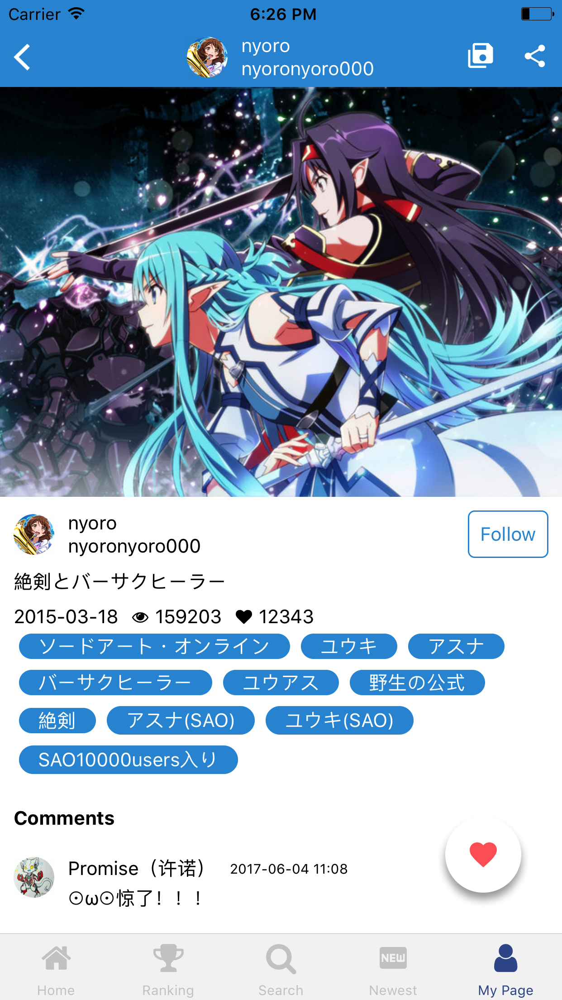

# PxView


[](https://github.com/prettier/prettier)
[](https://github.com/alphasp/pxview/pulls)

Unofficial Pixiv app client for Android and iOS, built in React Native.

## Gif


## Screenshots





## Features
- Tab navigation on iOS, drawer navigation on Android
- Ranking
	- Enjoy the latest popular works.
 	- Find trending works over the past day, week, or month.

- New Works
 - Check out new works from the users you're following.
 - View new works from your friends or all pixiv users

- Search
	- Search for your favourite works with keyword.
 	- Search for popular titles or characters.
 	- Search illustrations by tags or titles.
 	- Search for users.
 	- View the latest trends on pixiv with "Featured Tags"
- One tap button to save multiple images
- Mute and highlight tags (New in version 1.6)
- Tag Encyclopedia (New in version 1.6)
- Support localization (English, Japanese, Chinese)
- Ad free


## Download 
<a href='https://play.google.com/store/apps/details?id=com.utopia.pxview&pcampaignid=MKT-Other-global-all-co-prtnr-py-PartBadge-Mar2515-1'></a>


## Getting Started
1. `$ git clone https://github.com/alphasp/pxview`
2. `$ npm install`
3. `$ npm run pod-install`
4. `$ react-native link`
5. `$ npm run ios` or `npm run android`
6. (Optional) Set up Fabric / Crashlytics account on [Fabric.io](https://fabric.io/). 

	a) `Android`: Change value for `io.fabric.ApiKey` in `./android/app/src/main/AndroidManifest.xml`
	
	b) `iOS`: Change value for `Fabric APIKey` in `./ios/PxView/info.plist`
7. (Optional) Setup Firebase account on [Firebase](https://firebase.google.com/). Create a database, get apiKey, databaseURL, projectId from database settings, then change values for firebase config in `./src/common/config/env.dev.js` for development and `./src/common/config/env.prod.js` for production

## Application Architecture
- [redux](https://github.com/reactjs/redux) is a predictable state container for JavaScript apps, 
- [redux-saga](https://github.com/yelouafi/redux-saga/) is a library that aims to make side effects (i.e. asynchronous things like data fetching and impure things like accessing the browser cache) in React/Redux applications easier and better.
- [redux-persist]() is use to persist and rehydrate a redux store. It is use in this project to persist redux store in react-native `AsyncStorage` and rehydrate on app start.
- [react-navigation](https://github.com/react-community/react-navigation) is the official react-native navigation solution. It is extensible yet easy-to-use
- [react-native-localization](https://github.com/stefalda/ReactNativeLocalization) is a library to localize the ReactNative interface
- [react-native-fabric](https://github.com/corymsmith/react-native-fabric) is a React Native library for Fabric, Crashlytics and Answers. It is use in this project for crash reporting.
- [normalizr](https://github.com/paularmstrong/normalizr) normalizes nested JSON according to a schema
- [reselect](https://github.com/reactjs/reselect) is a selector library for Redux that is efficient and can compute derived data, allowing Redux to store the minimal possible state.
- And more..
 
## Troubleshooting

### Could not list contents of '<YOUR-APP-PATH>/node_modules/react-native/third-party/glog-0.3.4/test-driver'. Couldn't follow symbolic link.

`$ unlink node_modules/react-native/third-party/glog-0.3.4/test-driver`
Related issue in react-native [https://github.com/facebook/react-native/issues/14464](https://github.com/facebook/react-native/issues/14464)


## Tests
```
$ npm test
```

## Related Projects
[pixiv-api-client](https://github.com/alphasp/pixiv-api-client) - Api client for Pixiv

## Contribute
1. Fork [pxview](https://github.com/alphasp/pxview)
2. Follow steps in Getting Started to install dependencies and setup.
3. Make your code changes
4. `npm run lint` to lint and prettify codes, make sure all eslint warning and errors are fixed.
5. `npm test` to run test, make sure all tests are passed.
6. Commit and push your codes, then create a pull request.


## License

MIT